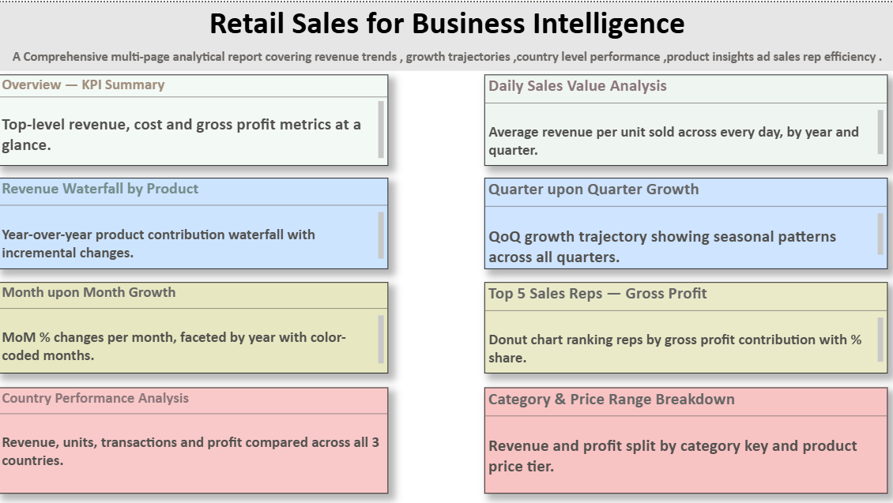
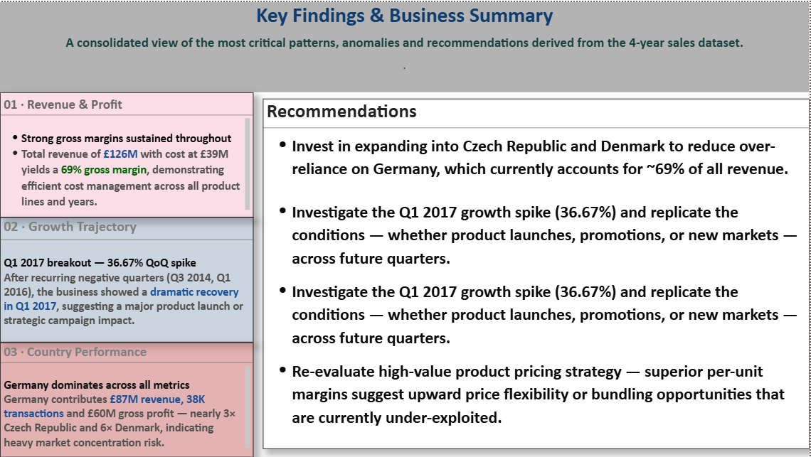

# 📊 Sales Performance Analytics Dashboard — Power BI

> A comprehensive multi-page business intelligence report analysing **£126M in revenue** across 3 countries, 4 years, multiple product lines and sales representatives — built entirely in Power BI Desktop.


---

## 🖼️ Introduction Page

> The introduction page gives a comprehensive overview of the entire report — listing all 8 dashboard pages with their descriptions, colour-coded by theme.
<details>

<summary>()</summary>
</details>

**Title:** Retail Sales for Business Intelligence

**Subtitle:** *A Comprehensive multi-page analytical report covering revenue trends, growth trajectories, country level performance, product insights and sales rep efficiency.*

<details>
<summary><strong>📋 Pages covered on the Introduction screen</strong></summary>

---

| Page | Colour | Description shown |
|---|---|---|
| Overview — KPI Summary | Blue-grey | Top-level revenue, cost and gross profit metrics at a glance |
| Daily Sales Value Analysis | Blue-grey | Average revenue per unit sold across every day, by year and quarter |
| Revenue Waterfall by Product | Light blue | Year-over-year product contribution waterfall with incremental changes |
| Quarter upon Quarter Growth | Light blue | QoQ growth trajectory showing seasonal patterns across all quarters |
| Month upon Month Growth | Olive/yellow | MoM % changes per month, faceted by year with color-coded months |
| Top 5 Sales Reps — Gross Profit | Olive/yellow | Donut chart ranking reps by gross profit contribution with % share |
| Country Performance Analysis | Pink/rose | Revenue, units, transactions and profit compared across all 3 countries |
| Category & Price Range Breakdown | Pink/rose | Revenue and profit split by category key and product price tier |

---

</details>

---

## 🏁 Conclusion Page

> The conclusion page consolidates the most critical patterns, anomalies and strategic recommendations derived from the entire 4-year sales dataset.



**Title:** Key Findings & Business Summary

**Subtitle:** *A consolidated view of the most critical patterns, anomalies and recommendations derived from the 4-year sales dataset.*

<details>
<summary><strong>🔍 Key Insights shown on the Conclusion page</strong></summary>

---

**01 · Revenue & Profit**
- Strong gross margins sustained throughout
- Total revenue of **£126M** with cost at £39M yields a **69% gross margin**, demonstrating efficient cost management across all product lines and years

**02 · Growth Trajectory**
- **Q1 2017 breakout — 36.67% QoQ spike**
- After recurring negative quarters (Q3 2014, Q1 2016), the business showed a dramatic recovery in Q1 2017, suggesting a major product launch or strategic campaign impact

**03 · Country Performance**
- **Germany dominates across all metrics**
- Germany contributes **£87M revenue, 38K transactions** and £60M gross profit — nearly 3× Czech Republic and 6× Denmark, indicating heavy market concentration risk

---

</details>

<details>
<summary><strong>💡 Recommendations shown on the Conclusion page</strong></summary>

---

1. **Expand into Czech Republic and Denmark** to reduce over-reliance on Germany, which currently accounts for ~69% of all revenue

2. **Investigate the Q1 2017 growth spike (36.67%)** and replicate the conditions — whether product launches, promotions, or new markets — across future quarters

3. **Re-evaluate high-value product pricing strategy** — superior per-unit margins suggest upward price flexibility or bundling opportunities that are currently under-exploited

---

</details>

---

## 🗂️ Table of Contents

- [Introduction Page](#️-introduction-page)
- [Conclusion Page](#-conclusion-page)
- [Project Overview](#project-overview)
- [Key Metrics](#key-metrics)
- [Dashboard Pages](#dashboard-pages)
- [Data Model](#data-model)
- [DAX Measures](#dax-measures)
- [Key Insights](#key-insights)
- [Screenshots](#screenshots)
- [Project Structure](#project-structure)
- [How to Use](#how-to-use)
- [Tools & Technologies](#tools--technologies)

---

## Project Overview

This Power BI dashboard was designed to provide decision-makers with a **360-degree view of sales performance** across multiple dimensions: time, geography, product category, price tier, and individual sales representative.

The report covers **2014 to 2017** and spans three European markets — Germany, Czech Republic, and Denmark — with data across product brands including VanHelen, Bing, Quad, Carlota, Black Monk, and Magnum.

<details>
<summary><strong>📌 Why this project was built</strong></summary>

---

Business stakeholders needed a self-service analytics tool to answer questions like:

- Which quarters showed the highest and lowest growth?
- Which country contributes most to gross profit?
- Are high-value products actually more profitable per unit?
- Which sales representatives drive the majority of profit?
- How does revenue fluctuate month-to-month and what seasonal patterns exist?

This dashboard answers all of these with interactive filters, slicers, and drill-through capabilities.

---

</details>

---

## Key Metrics

| Metric | Value |
|---|---|
| 💰 Total Revenue | £126.01M |
| 🏷️ Total Cost | £39.13M |
| 📈 Gross Profit | £86.89M |
| 📊 Gross Margin | ~69% |
| 🌍 Countries | 3 (Germany, Czech Republic, Denmark) |
| 🗓️ Time Period | 2014 – 2017 |
| 🔢 Total Transactions | ~55,000 |
| 👥 Top Sales Rep Share | 34.2% (Ellen Woody) |
| 📦 Total Units Sold | ~4M |
| 🚀 Peak QoQ Growth | +36.67% (Q1 2017) |

---

## Dashboard Pages

<details>
<summary><strong>Page 1 — KPI Overview (Summary Cards)</strong></summary>

---

**Topic: High-Level Business Snapshot**

Displays three colour-coded KPI cards:
- **Total Revenue** — £126.01M (purple border)
- **Total Cost** — £39.13M (lavender border)
- **Gross Profit** — £86.89M (teal/green border)

These cards serve as the executive-level entry point into the report, allowing stakeholders to immediately understand overall business health before drilling deeper.

---

</details>

<details>
<summary><strong>Page 2 — Average Sales Value Every Day</strong></summary>

---

**Topic: Daily Revenue vs Units Sold Analysis**

A clustered bar/line combo chart that plots:
- Total Revenue per day
- Total Units Sold per day
- Average Revenue per day

Filtered by **Month-Year** slicer (Jan 2014, Jan 2015, Jan 2016). The visual illustrates how daily average revenue fluctuates, peaks, and dips across each month — useful for identifying high-performing days and weak periods.

Key observation: Revenue peaks appear consistently around mid-month, particularly in Q1 months.

---

</details>

<details>
<summary><strong>Page 3 — Revenue Waterfall by Product & Year</strong></summary>

---

**Topic: Incremental Revenue Contribution by Product Name**

A **waterfall chart** showing cumulative revenue build from 2014 to 2017, broken down by product:

- Increases (dark blue bars) — products driving revenue up
- Decreases (orange bars) — products where revenue contracted
- Totals (light blue) — yearly aggregates
- Other categories shown in purple

Key products: **VanHelen** and **Black Monk** show consistent positive contributions; **Bing** showed a notable dip in 2015 before recovering.

Filters available: Country (Czech Republic, Denmark, Germany), Year, and MonthName slicer.

---

</details>

<details>
<summary><strong>Page 4 — Quarter upon Quarter (QoQ) Growth</strong></summary>

---

**Topic: Quarterly Revenue Growth Trajectory**

A column chart plotting **QoQ % growth** for every quarter from Q2 2014 through Q4 2017.

Notable values:
- Q2 2014: +6.14%
- Q3 2014: -7.09% *(worst quarter)*
- Q3 2015: +11.77%
- Q1 2016: -9.08%
- **Q1 2017: +36.67%** *(strongest single quarter)*
- Q2–Q4 2017: Modest positive growth (+2.39%, +1.42%, +0.49%)

The dramatic spike in Q1 2017 stands as the most significant event in the entire dataset.

---

</details>

<details>
<summary><strong>Page 5 — Month upon Month (MoM) Growth</strong></summary>

---

**Topic: Monthly Growth Rate Faceted by Year**

A grouped bar chart faceted by year (2014, 2015, 2016, 2017) with each bar representing a month's MoM % change, colour-coded by month name.

Key seasonal patterns:
- **Feb** consistently shows strong growth across years (28.95% in 2014, 30.71% in 2016, 37.12% in 2017)
- **Dec** frequently shows steep declines (−22.54% in 2015, −7.81% in 2017)
- **October** tends to be weak across most years

---

</details>

<details>
<summary><strong>Page 6 — Top 5 Sales Representatives (Gross Profit)</strong></summary>

---

**Topic: Sales Rep Performance by Gross Profit Contribution**

A **donut chart** ranking the top 5 sales representatives:

| Rank | Name | Gross Profit | Share |
|---|---|---|---|
| 1 | Ellen Woody | £23.68M | 34.2% |
| 2 | John White | £18.81M | 27.16% |
| 3 | Jan Novotny | £8.99M | 12.99% |
| 4 | Mark Spancer | £8.93M | 12.9% |
| 5 | Ellie Gill | £8.84M | 12.76% |

Ellen Woody and John White together account for **61.36%** of all top-5 gross profit.

Filterable by Country and Year (2014–2017).

---

</details>

<details>
<summary><strong>Page 7 — Country Performance Analysis</strong></summary>

---

**Topic: Geographic Revenue, Units, Transactions & Profit Breakdown**

Four horizontal bar charts displayed in a 2×2 grid:

| Metric | Germany | Czech Republic | Denmark |
|---|---|---|---|
| Total Revenue | £87M | £26M | £13M |
| Transactions | 38K | 11K | 6K |
| Units Sold | 2.8M | 0.8M | 0.4M |
| Gross Profit | £60M | £18M | £9M |

**Germany dominates across every single metric** — accounting for approximately 69% of revenue, 69% of transactions, and 69% of gross profit. This represents significant geographic concentration.

---

</details>

<details>
<summary><strong>Page 8 — Category Key Performance</strong></summary>

---

**Topic: Revenue, Units, Per-Unit Revenue & Profit by Category**

Four pie charts comparing Category 1 vs Category 2:

| Metric | Category 1 | Category 2 |
|---|---|---|
| Total Revenue | £81.22M (64.46%) | £44.79M (35.54%) |
| Units Sold | 3M (63.43%) | 1M (36.57%) |
| Per Unit Revenue | 51.11% | 48.89% |
| Gross Profit | £56.07M (64.53%) | £30.82M (35.47%) |

Category 1 is the dominant revenue and profit driver, maintaining similar share across all four metrics.

---

</details>

<details>
<summary><strong>Page 9 — Product Price Range Analysis</strong></summary>

---

**Topic: Revenue, Units, Per-Unit Revenue & Profit by Price Tier**

Four charts analysing three price categories — **Medium Value, High Value, Low Value**:

| Metric | Medium Value | High Value | Low Value |
|---|---|---|---|
| Revenue | £51.59M (40.94%) | £48.14M (38.2%) | £26.28M (20.86%) |
| Units Sold | 45.54% | 27.2% | 27.26% |
| Per Unit Revenue | 45.76% | 24.94% | 29.3% |
| Gross Profit | £35.81M (41.22%) | £33.08M (38.07%) | £18M (20.71%) |

High-value products, despite lower unit volume, maintain revenue share nearly equal to medium-value — indicating strong pricing power.

---

</details>

---

## Data Model

<details>
<summary><strong>📐 Star Schema — Fact & Dimension Tables</strong></summary>

---

The data model follows a **Star Schema** design:

```
        DimDate
           |
DimProduct ── FactSales ── DimSalesRep
           |
       DimCountry
```

**Fact Table:**
- `FactSales` — contains SalesPrimaryKey, Date, Revenue, Cost, Units Sold, ProductKey, CountryKey, SalesRepKey, CategoryKey

**Dimension Tables:**
- `DimDate` — Year, Quarter, Month, MonthName, Day, Qtr-Year
- `DimProduct` — ProductName, CategoryKey, PriceCategory (Low/Medium/High)
- `DimSalesRep` — SalesRepName
- `DimCountry` — Country name

> 📸 *See `/screenshots/data_model_relationships.png` for the full relationship diagram.*


---

</details>

---

## DAX Measures

<details>
<summary><strong>🧮 Core Measures</strong></summary>

---

```dax
Total Revenue = SUM(FactSales[Revenue])

Total Cost = SUM(FactSales[Cost])

Gross Profit = [Total Revenue] - [Total Cost]

Total Units Sold = SUM(FactSales[UnitsSold])

Average Revenue of everyday = 
    DIVIDE([Total Revenue], [Total Units Sold])
```

---

</details>

<details>
<summary><strong>📅 Time Intelligence Measures</strong></summary>

---

```dax
-- Quarter-on-Quarter Growth
QOQ Growth = 
VAR CurrentQ = [Total Revenue]
VAR PrevQ = CALCULATE([Total Revenue], PREVIOUSQUARTER(DimDate[Date]))
RETURN DIVIDE(CurrentQ - PrevQ, PrevQ)

-- Month-on-Month Growth
MOM Growth = 
VAR CurrentM = [Total Revenue]
VAR PrevM = CALCULATE([Total Revenue], PREVIOUSMONTH(DimDate[Date]))
RETURN DIVIDE(CurrentM - PrevM, PrevM)
```

---

</details>

---

## Key Insights

<details>
<summary><strong>🔍 Business Findings Summary</strong></summary>

---

1. **69% gross margin** sustained consistently, indicating efficient cost control
2. **Q1 2017 saw 36.67% QoQ growth** — the single biggest quarterly jump in 4 years
3. **Germany accounts for ~69% of all revenue** — geographic concentration risk
4. **Ellen Woody + John White = 61%** of top-5 rep gross profit — key-person dependency
5. **February is consistently the strongest month** across all 4 years for MoM growth
6. **December sees consistent MoM declines** — actionable for inventory and promotion planning
7. **High-value products** have the best per-unit revenue despite lower sales volume
8. **Category 1 dominates with 64%** revenue share across all metrics

---

</details>

---

## Screenshots

<details>
<summary><strong>🖼️ Dashboard Screenshots</strong></summary>

---

| Page | Description |
|---|---|
| ) | Introduction Page — Report Navigator |
| ) | KPI Summary Cards |
| ) | Average Daily Sales Value |
| ) | Product Revenue Waterfall |
| ) | Quarter on Quarter Growth |
| ) | Month on Month Growth |
| ) | Top 5 Sales Representatives |
| ) | Country Performance |
| ) | Category Key Breakdown |
| ) | Price Range Analysis |
| ) | Star Schema Relationships |
| ) | Conclusion Page — Key Findings & Recommendations |


---

</details>

---

## Project Structure

```
📁 Sales-Performance-Dashboard/
│
├── 📊 SalesPerformanceDashboard.pbix    ← Main Power BI file
│
├── 📁 data/
│   ├── sales_fact.csv                   ← Raw fact table data
│   ├── dim_date.csv                     ← Date dimension
│   ├── dim_product.csv                  ← Product dimension
│   ├── dim_salesrep.csv                 ← Sales rep dimension
│   └── dim_country.csv                  ← Country dimension
│
├── 📁 screenshots/
│   ├── Introduction.png                 ← ⭐ Introduction page 
│   ├── Conclusion.png                   ← ⭐ Conclusion page 
│   ├── 01_kpi_overview.png
│   ├── 02_daily_sales_value.png
│   ├── 03_revenue_waterfall.png
│   ├── 04_qoq_growth.png
│   ├── 05_mom_growth.png
│   ├── 06_top5_sales_reps.png
│   ├── 07_country_analysis.png
│   ├── 08_category_analysis.png
│   ├── 09_price_range.png
│   └── data_model_relationships.png     ← ⭐ Fact-Dimension relationship view
│
└── 📄 README.md
```

---

## How to Use

<details>
<summary><strong>🚀 Getting Started</strong></summary>

---

1. **Clone or download** this repository
2. Open `SalesPerformanceDashboard.pbix` in **Power BI Desktop** (free download from Microsoft)
3. If data source paths differ, go to **Home → Transform Data → Data Source Settings** and update paths
4. Use the **slicers** on each page to filter by Year, Country, and Month
5. Click on any chart element to **cross-filter** all other visuals on the page
6. Use **page navigation tabs** at the bottom to switch between report pages

---

</details>

---

## Tools & Technologies

| Tool | Purpose |
|---|---|
| Power BI Desktop | Report authoring & publishing |
| DAX | Calculated measures & KPIs |
| Power Query (M) | Data transformation & cleaning |
| Star Schema | Data modelling architecture |
| Waterfall Chart | Product revenue decomposition |
| Donut/Pie Charts | Proportional breakdown visuals |
| Custom Date Table | Time intelligence support |
| Slicers & Filters | Interactive user filtering |

---

## 📬 Contact

Built by [Vaishali Upadhyay] · [https://www.linkedin.com/in/vaishali-upadhyay] · [https://github.com/vaishu1711/Sales_Analysis-on-PowerBI-SQL/edit/main/README.md]

---

*Built with ❤️ using Power BI Desktop*
